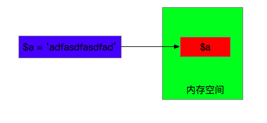
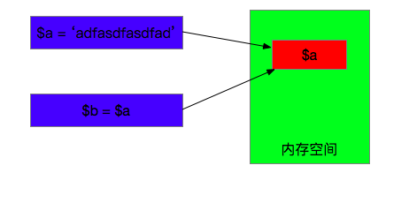

本文主要介绍Copy-On-Write的基本思想已经应用场景。

<!-- more -->

## 名词解释
COW是Copy On Write的缩写，意为<strong>写时复制</strong>
## 示例
```PHP
<?php
//Step 1
echo memory_get_usage();
echo "\n";
//输出：352072
//Step 2
$a = 'fasdfadfadasdfasdfadadafqoweuhfoquhfasjdajdfoquwehfhoqjdfajdnoqwuehfoqwudfadjfnlasjdfqowuefoquwefadbflasjdfoqjfoquwfqofqiuwfqowufdfqijfqjewpqifpqwfqdfn23u9qwey82934r7803yr10423701710374047hfjnvmxcbvbxcvmnxcnvlcnvlamnv.anvlaksdvnaldjavnv.cvnbvbvcnzbv,cnvz.cvncvz.cvn,cv.zv';
echo memory_get_usage();
echo "\n";
//输出：352104
//Step 3
$b = $a;
echo memory_get_usage();
echo "\n";
//输出：352104
//Step 4
$a = substr($a, 0, strlen($a)-2);
echo memory_get_usage();
echo "\n";
//输出：352424
```
## 情景分析
1、`$b = $a`变量赋值的时候内存占用并没有翻倍 

2、修改变量`$a`的值的时候，内存占用升高

## 原理解析
1、创建变量$a，为$a申请内存

 

2、创建变量$b，并将$a的值复制给$b，这时候其实并没有为$b申请新的内存空间

 

3、修改变量$a的值后，这时候会为$a重新申请内存

 >

## PHP的坑
```PHP
<?php
$a = 10;
$b = &$a;
unset($b);
echo $a; //10
```
`unset($b)`只是删掉了$b指向内存的指针（引用计数减1），并没有实际销毁内存

## COW的典型应用
### fork
fork是类Unix操作系统下创建进程的一种主要方法，执行fork函数的被认为是父线程，创建的新进程被称为子进程，子进程共享父进程的执行上下文信息，其中包括堆、栈、打开文件的描述符、共享内存


#### code分析

```
#include <stdio.h>
#include <unistd.h>

int     glob = 6;       /* external variable in initialized data */

main(void)
{
    int       var;      /* automatic variable on the stack */
    pid_t     pid;

    var = 88;
    
    printf("pid = %d, glob = %p, var = %p\n", getpid(), &glob, &var);

    if (write(STDOUT_FILENO, buf, sizeof(buf)-1) != sizeof(buf)-1)
        printf("write error\n");
    printf("before fork\n");    /* we don't flush stdout */

    if ((pid = fork()) < 0) {
        printf("fork error");
    } else if (pid == 0) {      /* child */
        glob++;                 /* modify variables */
        var++;
    } else {
        sleep(2);               /* parent */
    }

    printf("pid = %d, glob = %p, var = %p\n", getpid(), &glob, &var);
}
```
#### 输出分析

> pid = 31989, glob = 0x60104c, var = 0x7ffe1e5536c8
> 
> before fork
> 
> pid = 31990, glob = 0x60104c, var = 0x7ffe1e5536c8
> 
> pid = 31989, glob = 0x60104c, var = 0x7ffe1e5536c8
> 

为啥地址是一样的呢？？？

fork子进程完全复制父进程的栈空间，也复制了页表，但没有复制物理页面，所以这时虚拟地址相同，物理地址也相同，但是会把父子共享的页面标记为“只读”，如果父子进程一直对这个页面是同一个页面，知道其中任何一个进程要对共享的页面“写操作”，这时内核会复制一个物理页面给这个进程使用，同时修改页表。而把原来的只读页面标记为“可写”


#### 结论
子进程复制父进程的虚拟地址空间，虚拟地址空间到物理地址空的映射是通过页表完成，所以，相同的虚拟地址实际的值也可能不同，因为虚拟地址对应的页表改变了。

## 总结
Copy-On-Write的中心思想就是延迟复制，减少不必要的地址拷贝，从而提升性能。

