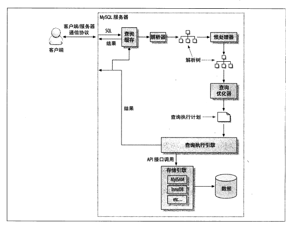
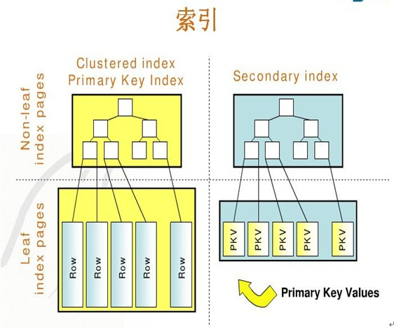

大家应该都知道 ，MySQL单表过大，查询性能会直线下降，这时候就需要通过分库分表的方式来对单表划分多个小表，依此来提高性能。

那么问题来了，Mysql单表过大为什么查询性能会下降？MySQL单表过大的标准是多少？500W?2000W？

本文将来着这些问题来一探究竟。由于大部分业务生产环境的引擎使用的InnoDB，本文所有观点皆基于InnoDB引擎来阐述。

<!-- more -->

为了回答这些问题，我们先介绍一些基本概念和过程。

## Mysql查询

### Mysql SQL查询过程

1. 客户端发送一条查询给服务器；

2. 服务器先会检查查询缓存，如果命中了缓存，则立即返回存储在缓存中的结果。否则进入下一阶段；

3. 服务器端进行SQL解析、预处理，再由优化器生成对应的执行计划；

4. MySQL根据优化器生成的执行计划，调用存储引擎的API来执行查询；

5. 将结果返回给客户端。

### 存储引擎查询过程

聚簇索引和非聚簇索引的概念此处不再赘述，请自行搜索。

> 聚集索引一个表只能有一个，而非聚集索引一个表可以存在多个 ！ 

> 聚集索引存储记录是物理上连续存在，而非聚集索引是逻辑上的连续，物理存储并不连续 ！

> innodb_buffer_pool ,  是InnoDB在内存中维护一个缓存池用于缓存数据和索引。（不仅仅是数据，而且有索引， 其实最主要还是B+tree索引 !），通过LRU算法淘汰长时间未被访问的部分。

Innodb查询的过程如下：

- 如果是< 聚集索引 >，那么会在 innodb_buffer_pool里找到第一层B+tree,  如果找到区间，那么继续找第二层B+tree， 最终拿到row 数据 。

- 如果是< 非聚集索引 >，那么就是找到相关的非聚集索引了，通过索引字段查到对应的主键，然后拿着主键去拿聚集索引拿数据。

### SQL查询过程中的磁盘IO次数

最差情况下的查询过程：

1. 从innodb_buffer_pool中取出第一层节点数据，节点在内存中，不需要磁盘IO；
2. 第一层未查到，从第二层查，需要磁盘IO加载第二层节点；
3. 第二层查询不到，从第三层查，需要磁盘IO加载第三层节点；
4. 第三层查询不到，从第四层查，需要磁盘IO加载第四层节点；

> 4层的B+tree基本能存储100亿级别的数据了。

综上，最坏最慢的结果是： 通过非聚集索引找到主键，花费3个io，又通过主键找到具体数据，又花费了3个io。事实上， mysql innodb会把前两层的索引装载到内存中的 。

## Mysql单表为什么不宜过大

有了以上基础，我们可以回答第一个问题了。`MySQL单表为什么不宜过大`

运维、使用层面：

1. alter操作耗时过长，可以这么理解，加字段、加索引、修改字段这些基本没法操作了。
2. count、sum这些也没法搞了。

原理层面：
1. B+树层级越高，查询IO次数越多，越耗时。
2. 缓存污染，缓存空间有限，导致缓存命中率低，缓存污染等问题。

## InnoDB 3层B+树存储容量计算

从上面的分析我们知道，B+树的层数越多，数据的容量越大，查询效率越低。

生产环境中，一般单表B+树达到三层就可以考虑做分表了。

那么一个三层B+树具体能容纳多少数据呢？

我们先来看几个基础数据。

在计算机中，磁盘存储数据最小单元是扇区，一个扇区的大小是512字节，而文件系统（例如XFS/EXT4）他的最小单元是块，一个块的大小是4k，而对于我们的InnoDB存储引擎也有自己的最小储存单元——页（Page），一个页的大小是16K（可修改）。

假设一行数据的大小是1k，那么一个页可以存放16行这样的数据。

我们先假设B+树高为2，即存在一个根节点和若干个叶子节点，那么这棵B+树的存放总记录数为：`根节点指针数*单个叶子节点记录行数`。

上文我们已经说明单个叶子节点（页）中的`记录数=16K/1K=16`。（这里假设一行记录的数据大小为1k，实际上现在很多互联网业务数据记录大小通常就是1K左右）。

那么现在我们需要计算出非叶子节点能存放多少指针，其实这也很好算，我们假设主键ID为bigint类型，长度为8字节，而指针大小在InnoDB源码中设置为6字节，这样一共14字节，我们一个页中能存放多少这样的单元，其实就代表有多少指针，即`16384/14=1170`。那么可以算出一棵高度为2的B+树，能存放`1170*16=18720`条这样的数据记录。

根据同样的原理我们可以算出一个高度为3的B+树可以存放：`1170*1170*16=21902400`条这样的记录。所以在InnoDB中B+树高度一般为1-3层，它就能满足千万级的数据存储。在查找数据时 一次页的查找代表一次IO， 所以通过主键索引查询通常 只需要1-3次IO操作 即可查找到数据。

## 参考资料
1. http://xiaorui.cc/2016/12/08/%E4%B8%BA%E4%BB%80%E4%B9%88%E4%B8%8D%E5%BB%BA%E8%AE%AEinnodb%E4%BD%BF%E7%94%A8%E4%BA%BF%E7%BA%A7%E5%A4%A7%E8%A1%A8/
2. https://blog.csdn.net/csdnlijingran/article/details/102309593
