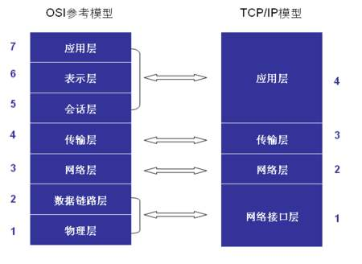
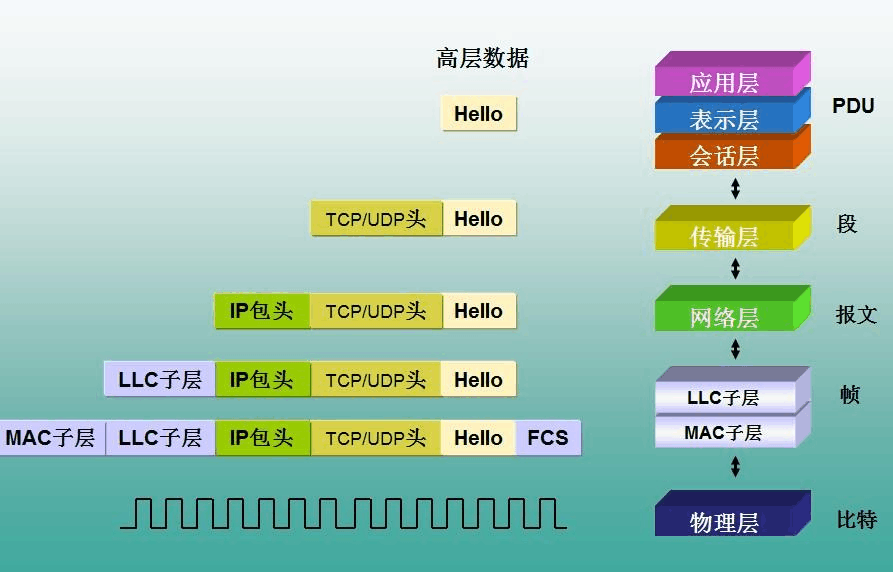

正在埋头写代码的兴头上，突然企微故障群不停地闪动，提示有人@。

> A: `xxx，你负责的服务不可用了，七层Nginx疯狂报警，赶快看一下日志`。

> 我：挠头！7层是什么鬼？我命名在6层办公啊！

> 这时老大来了，丢下一句。

> 老大：‘你可以收拾东西回家了’。

> 我：卧槽！我真在6层办公。

> 。。。。。。

<!-- more -->

回家赶快google一下，哦，原来是7层协议的七层啊，不是楼层数啊。泪崩。。。

## 协议模型

### OSI

 

### TCP/IP模型

## 负载均衡
常见的负载均衡主要是四层负载均衡和七层负载均衡。

> 负载均衡器通常称为四层交换机或七层交换机。四层交换机主要分析IP层及TCP/UDP层，实现四层流量负载均衡。七层交换机除了支持四层负载均衡以外，还有分析应用层的信息，如HTTP协议URI或Cookie信息。

> 所谓四层就是基于IP+端口的负载均衡;

> 七层就是基于URL等应用层信息的负载均衡;
> 
> 同理，还有基于MAC地址的二层负载均衡和基于IP地址的三层负载均衡。

### 区别与应用

|   区别     |四层负载均衡 |  七层负载均衡  |
| --------  | :-----:   | :----: |
| 作用层     | TCP       |   HTTP  |
| 原理       | IP+端口    |  可根据七层的URL、浏览器类别、语言来决定是否要进行负载均衡    |
| 应用       | 范围广，效率高，适合最前端       | 比如基于url、session、动静分离等   |
| 软件       | LVS，F5 等       |   Nginx，haproxy，MySQL Proxy等 |
| 优点       |  效率高，服务无侵入  | 使得网络智能化，支持更细粒度的转发|
|缺点        | 不识别应用层服务细节，不支持应用层转发  | 并发性能相对四层较低|

## 参考资料
1. https://cloud.tencent.com/developer/news/97649
2. https://www.cnblogs.com/zhaiyf/p/9051694.html
